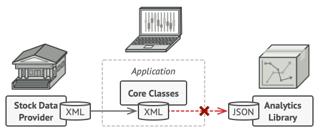
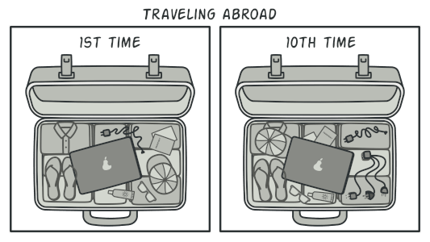

# Adapter

> **Also known as:** Wrapper

## Intent

**Adapter** is a structural design pattern that allows objects with incompatible interfaces to collaborate.

## Problem

Imagine that you’re creating a stock market monitoring app. The app downloads the stock data from multiple sources in XML format and then displays nice-looking charts and diagrams for the user.

At some point, you decide to improve the app by integrating a smart 3rd-party analytics library. But there’s a catch: the analytics library only works with data in JSON format.

You could change the library to work with XML. However, this might break some existing code that relies on the library. And worse, you might not have access to the library’s source code in the first place, making this approach impossible.

## Solution

You can create an _adapter_. This is a special object that converts the interface of one object so that another object can understand it.

An adapter wraps one of the objects to hide the complexity of conversion happening behind the scenes. The wrapped object isn’t even aware of the adapter. For example, you can wrap an object that operates in meters and kilometers with an adapter that converts all of the data to imperial units such as feet and miles.

Adapters can not only convert data into various formats but can also help objects with different interfaces collaborate. Here’s how it works:

1. The adapter gets an interface, compatible with one of the existing objects.
2. Using this interface, the existing object can safely call the adapter’s methods.
3. Upon receiving a call, the adapter passes the request to the second object, but in a format and order that the second object expects.

Sometimes it’s even possible to create a two-way adapter that can convert the calls in both directions.

Let’s get back to our stock market app. To solve the dilemma of incompatible formats, you can create XML-to-JSON adapters for every class of the analytics library that your code works with directly. Then you adjust your code to communicate with the library only via these adapters. When an adapter receives a call, it translates the incoming XML data into a JSON structure and passes the call to the appropriate methods of a wrapped analytics object.

## Real-World Analogy

When you travel from the US to Europe for the first time, you may get a surprise when trying to charge your laptop. The power plug and sockets standards are different in different countries. That’s why your US plug won’t fit a German socket. The problem can be solved by using a power plug adapter that has the American-style socket and the European-style plug.

## Structure

### Object adapter

This implementation uses the object composition principle: the adapter implements the interface of one object and wraps the other one. It can be implemented in all popular programming languages.

1. The **Client** is a class that contains the existing business logic of the program.

2. The **Client Interface** describes a protocol that other classes must follow to be able to collaborate with the client code.

3. The **Service** is some useful class (usually 3rd-party or legacy). The client can’t use this class directly because it has an incompatible interface.

4. The **Adapter** is a class that’s able to work with both the client and the service: it implements the client interface, while wrapping the service object. The adapter receives calls from the client via the adapter interface and translates them into calls to the wrapped service object in a format it can understand.

5. The client code doesn’t get coupled to the concrete adapter class as long as it works with the adapter via the client interface. Thanks to this, you can introduce new types of adapters into the program without breaking the existing client code. This can be useful when the interface of the service class gets changed or replaced: you can just create a new adapter class without changing the client code.

### Class adapter

This implementation uses inheritance: the adapter inherits interfaces from both objects at the same time. Note that this approach can only be implemented in programming languages that support multiple inheritance, such as C++.

1. The **Class Adapter** doesn’t need to wrap any objects because it inherits behaviors from both the client and the service. The adaptation happens within the overridden methods. The resulting adapter can be used in place of an existing client class.

## Applicability

1. Use the Adapter class when you want to use some existing class, but its interface isn’t compatible with the rest of your code.

> The Adapter pattern lets you create a middle-layer class that serves as a translator between your code and a legacy class, a 3rd-party class or any other class with a weird interface.

2. Use the pattern when you want to reuse several existing subclasses that lack some common functionality that can’t be added to the superclass.

> You could extend each subclass and put the missing functionality into new child classes. However, you’ll need to duplicate the code across all of these new classes, which smells really bad.

> The much more elegant solution would be to put the missing functionality into an adapter class. Then you would wrap objects with missing features inside the adapter, gaining needed features dynamically. For this to work, the target classes must have a common interface, and the adapter’s field should follow that interface. This approach looks very similar to the Decorator pattern.

## How to Implement

1. Make sure that you have at least two classes with incompatible interfaces:
  - A useful service class, which you can’t change (often 3rd-party, legacy or with lots of existing dependencies).
  - One or several client classes that would benefit from using the service class.

2. Declare the client interface and describe how clients communicate with the service.

3. Create the adapter class and make it follow the client interface. Leave all the methods empty for now.

4. Add a field to the adapter class to store a reference to the service object. The common practice is to initialize this field via the constructor, but sometimes it’s more convenient to pass it to the adapter when calling its methods.

5. One by one, implement all methods of the client interface in the adapter class. The adapter should delegate most of the real work to the service object, handling only the interface or data format conversion.

6. Clients should use the adapter via the client interface. This will let you change or extend the adapters without affecting the client code.

## Pros and Cons

| Nice | Bad |
| --------------- | --------------- |
| _Single Responsibility Principle_. You can separate the interface or data conversion code from the primary business logic of the program. | The overall complexity of the code increases because you need to introduce a set of new interfaces and classes. Sometimes it’s simpler just to change the service class so that it matches the rest of your code. |
| _Open/Closed Principle_. You can introduce new types of adapters into the program without breaking the existing client code, as long as they work with the adapters through the client interface. | |

## Relations with Other Patterns

- Bridge is usually designed up-front, letting you develop parts of an application independently of each other. On the other hand, Adapter is commonly used with an existing app to make some otherwise-incompatible classes work together nicely.

- Adapter changes the interface of an existing object, while Decorator enhances an object without changing its interface. In addition, Decorator supports recursive composition, which isn’t possible when you use Adapter.

- Adapter provides a different interface to the wrapped object, Proxy provides it with the same interface, and Decorator provides it with an enhanced interface.

- Facade defines a new interface for existing objects, whereas Adapter tries to make the existing interface usable. Adapter usually wraps just one object, while Facade works with an entire subsystem of objects.

- Bridge, State, Strategy (and to some degree Adapter) have very similar structures. Indeed, all of these patterns are based on composition, which is delegating work to other objects. However, they all solve different problems. A pattern isn’t just a recipe for structuring your code in a specific way. It can also communicate to other developers the problem the pattern solves.

---

[Adapter in C++](https://refactoring.guru/design-patterns/adapter/cpp/example)